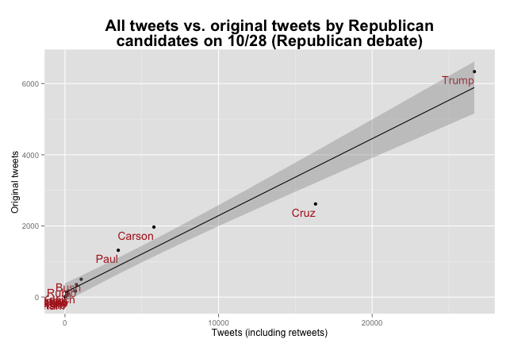

# Using twitter to analyze the popularity of Presidential candidates

I've been scraping fantasy football weekly projection websites with R and gaining regex skills in manipulating the data.  My next step was to take on Twitter and do some exporatory analysis.

It actually took me a while to get tweets using the Twitter API.  For some reason, everytime I tried to login I would get an error that my keys and tokens were not authorized.  After spending too much time on it, I decided to hack my husband's account and create a new development account within his account.  Problem solved!  It is still unknown why I couldn't get my development account to work.

```library("devtools")
library("twitteR")
library("rjson")
library("bit64")
library("httr")
library("ggplot2")

api_key <- "<my api_key>"
api_secret <- "<my api_secret>"
access_token <- "<my access_token>"
access_token_secret <- "<my access_token_secret>"

setup_twitter_oauth(api_key,api_secret,access_token,access_token_secret)
```

I used the most popular hashtags that I identified for each Presidential candidate, with the exception of Ben Carson, who seemed to be promoting two hashtags on that day (#bencarson, #BC2DC16).  I grabbed the tweets with the hashtags using the twitteR library in R.  I wanted to make sure that I got every tweet during the day so I defined n (default = 25).

```
Bush = searchTwitter("#jebbush", n = 10000, since = "2015-11-10", until = "2015-11-11")
Carson = searchTwitter("#bencarson OR #BC2DC16", n = 20000, since = "2015-11-10", until = "2015-11-11")
Christie = searchTwitter("#Christie2016", n=10000, since = "2015-11-10", until = "2015-11-11")
Clinton = searchTwitter("#Hillary2016", n = 50000,  since = "2015-11-10", until = "2015-11-11")
Cruz = searchTwitter("#CruzCrew", n = 50000, since = "2015-11-10", until = "2015-11-11")
Fiorina = searchTwitter("#CarlyFiorina", n = 10000,  since = "2015-11-10", until = "2015-11-11")
#Graham = searchTwitter("#LindseyGrahamSC", n = 10000,  since = "2015-11-10", until = "2015-11-11")
Huckabee = searchTwitter("#Huckabee", n = 10000,  since = "2015-11-10", until = "2015-11-11")
Jindal = searchTwitter("#bobbyjindal", n = 10000,  since = "2015-11-10", until = "2015-11-11")
Kasich = searchTwitter("#kasich", n = 10000,  since = "2015-11-10", until = "2015-11-11")
Pataki = searchTwitter("#Pataki", n = 10000,  since = "2015-11-10", until = "2015-11-11")
Paul = searchTwitter("#standwithrand", n = 30000, since = "2015-11-10", until = "2015-11-11")
Rubio = searchTwitter("#MarcoRubio", n = 30000,  since = "2015-11-10", until = "2015-11-11")
Sanders = searchTwitter("#FeeltheBern", n = 50000,  since = "2015-11-10", until = "2015-11-11")
Santorum = searchTwitter("#RickSantorum", n = 10000,  since = "2015-11-10", until = "2015-11-11")
Trump = searchTwitter("#Trump2016", n = 50000,  since = "2015-11-10", until = "2015-11-11")
```

I stripped the retweets so I knew that I had just original tweets.

```
Bush_nr = strip_retweets(Bush)
Carson_nr = strip_retweets(Carson)
Christie_nr = strip_retweets(Christie)
Clinton_nr = strip_retweets(Clinton)
Cruz_nr = strip_retweets(Cruz)
Fiorina_nr = strip_retweets(Fiorina)
#Graham_nr = strip_retweets(Graham)
Huckabee_nr = strip_retweets(Huckabee)
Jindal_nr = strip_retweets(Jindal)
Kasich_nr = strip_retweets(Kasich)
Pataki_nr = strip_retweets(Pataki)
Paul_nr = strip_retweets(Paul)
Rubio_nr = strip_retweets(Rubio)
Sanders_nr = strip_retweets(Sanders)
Santorum_nr = strip_retweets(Santorum)
Trump_nr = strip_retweets(Trump)
```

and converted the lists to data frames.

```
Bush.df <- twListToDF(Bush_nr)
Carson.df <- twListToDF(Carson_nr)
Christie.df <- twListToDF(Christie_nr)
Clinton.df <- twListToDF(Clinton_nr)
Cruz.df <- twListToDF(Cruz_nr)
Fiorina.df <- twListToDF(Fiorina_nr)
#Graham.df <- twListToDF(Graham_nr)
Huckabee.df <- twListToDF(Huckabee_nr)
Jindal.df <- twListToDF(Jindal_nr)
Kasich.df <- twListToDF(Kasich_nr)
Paul.df <- twListToDF(Paul_nr)
Pataki.df <- twListToDF(Pataki_nr)
Rubio.df <- twListToDF(Rubio_nr)
Sanders.df <- twListToDF(Sanders_nr)
Santorum.df <- twListToDF(Santorum_nr)
Trump.df <- twListToDF(Trump_nr)
```

Finally, I added the hashtag to each individual data frame before combining them.

```
Bush.df$hashtag <- as.factor("#jebbush")
Carson.df$hashtag <- as.factor("#bencarson")
Christie.df$hashtag <- as.factor("#Christie2016")
Clinton.df$hashtag <- as.factor("#Hillary2016")
Cruz.df$hashtag <- as.factor("#CruzCrew")
Fiorina.df$hashtag <- as.factor("#CarlyFiorina")
#Graham.df$hashtag <- as.factor("#LindseyGrahamSC")
Huckabee.df$hashtag <- as.factor("#Huckabee")
Jindal.df$hashtag <- as.factor("#bobbyjindal")
Kasich.df$hashtag <- as.factor("#Kasich")
Pataki.df$hashtag <- as.factor("#Pataki")
Sanders.df$hashtag <- as.factor("#FeeltheBern")
Santorum.df$hashtag <- as.factor("#RickSantorum")
Paul.df$hashtag <- as.factor("#standwithrand")
Rubio.df$hashtag <- as.factor("#MarcoRubio")
Trump.df$hashtag <- as.factor("#Trump2016")

df <- rbind(Christie.df, Carson.df, Fiorina.df, Clinton.df, Huckabee.df, Kasich.df, Pataki.df, Jindal.df, Santorum.df, Bush.df, Cruz.df, Rubio.df, Paul.df, Trump.df, Sanders.df)
```

I compared all tweets (including retweets) vs. original tweets (no retweets) for all Presidential candidates.  I wanted to see whether the proportions were different for the different candidates.  The shaded are represents the standard deviation so I could see if we had any outliers.




